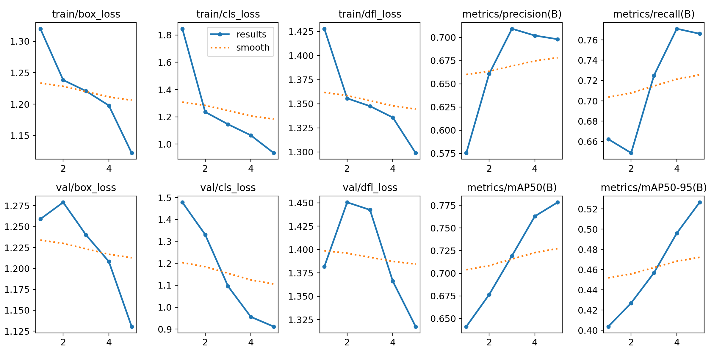
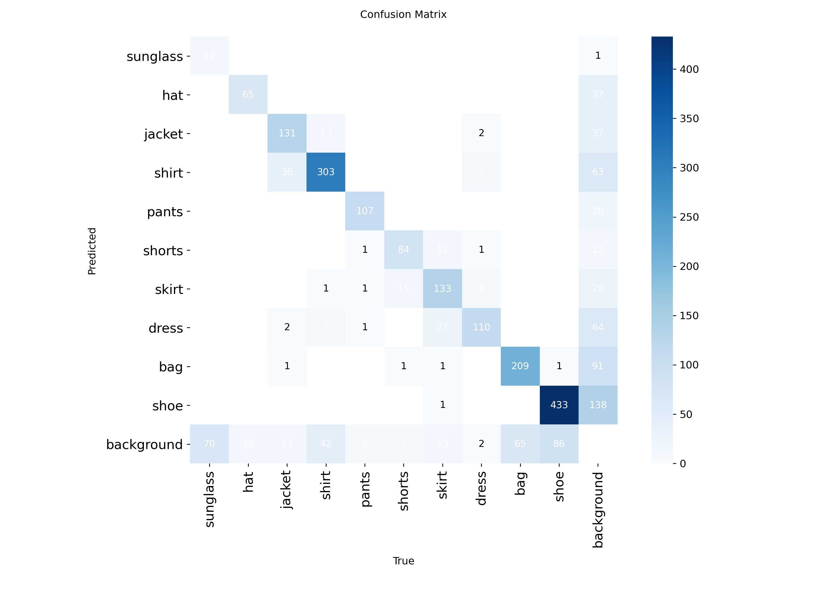
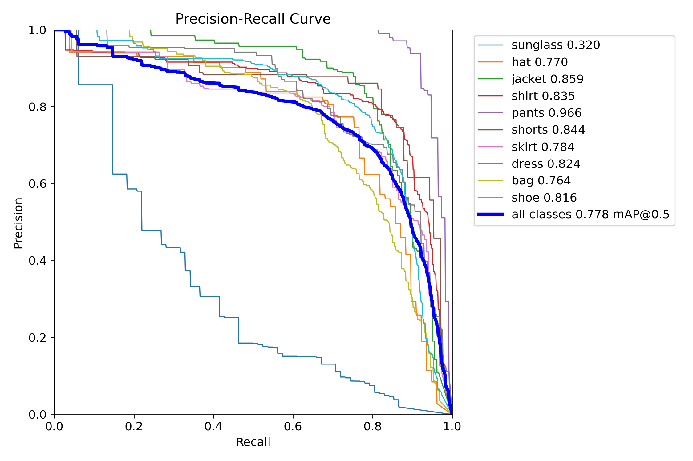
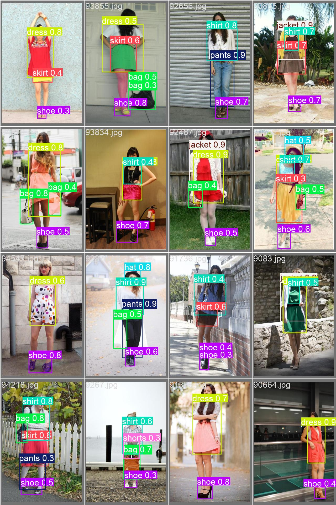

# 🎥 Flickd - AI-Powered Fashion Detection and Matching

[](https://www.python.org/downloads/)
[](LICENSE)
[](https://github.com/ultralytics/ultralytics)
[](https://github.com/openai/CLIP)

<div align="center">
  <em>AI-powered fashion detection and matching system</em>
</div>

## 📋 Overview

Flickd is an advanced AI system that revolutionizes fashion detection in videos. It combines state-of-the-art computer vision and natural language processing to:
- Detect fashion items in video frames
- Match detected items with similar products from a catalog
- Classify fashion vibes and styles
- Provide detailed product recommendations

## ✨ Key Features

### 🎯 Core Capabilities
- **Video Processing**
  - Intelligent frame extraction
  - High-performance video analysis
  - Batch processing support

- **Fashion Detection**
  - YOLOv8-based object detection
  - Multi-class fashion item recognition
  - Real-time processing capabilities

- **Product Matching**
  - CLIP embeddings for semantic matching
  - FAISS indexing for fast similarity search
  - Smart caching system

- **Style Analysis**
  - Vibe classification
  - Color analysis
  - Style matching

### 🛠️ Technical Features
- Comprehensive logging system
- Error handling and recovery
- Efficient caching mechanisms
- GPU acceleration support

## 🚀 Getting Started

### Prerequisites
- Python 3.8 or higher
- CUDA-capable GPU (recommended)
- Git

### Installation

1. **Clone the Repository**
   ```bash
   git clone https://github.com/adi-devv/Flickd-AI-Hackathon.git
   cd Flickd-AI-Hackathon
   ```

2. **Set Up Virtual Environment**
   ```bash
   # Create virtual environment
   python -m venv venv
   
   # Activate virtual environment
   # On Windows:
   venv\Scripts\activate
   # On Unix or MacOS:
   source venv/bin/activate
   ```

3. **Install Dependencies**
   ```bash
   pip install -r requirements.txt
   ```

4. **Download YOLOv8 Model**
   ```bash
   wget https://github.com/ultralytics/assets/releases/download/v0.0.0/yolov8m.pt
   ```

## 📁 Project Structure

```
Flickd/
├── main.py                      # Main processing script
├── data/
│   ├── cache/                  # Cached embeddings and indices
│   │   ├── cache_metadata.pkl  # Cache metadata
│   │   ├── faiss_index.bin     # FAISS index file
│   │   ├── product_info.pkl    # Product information cache
│   │   └── product_id_to_indices.pkl  # Product ID mapping
│   ├── product_data.csv        # Product catalog data
│   └── images.csv             # Image URLs and metadata
├── detected_frames/            # Frames with detection boxes
│   └── detected_frame_*.jpg   # Annotated frames with bounding boxes
├── cropped_frames/            # Cropped detected items
│   └── crop_frame_*_*.jpg    # Cropped fashion items (format: frame_number_item_class.jpg)
├── frames/                    # Extracted video frames
│   └── frame_*.jpg           # Raw video frames
├── outputs/                  # JSON output files
│   ├── output_*.json        # Detection and matching results
│   └── vibe_*.json         # Style classification results
├── models/                  # Model files
│   └── yolov8m.pt         # YOLOv8 model weights
├── api/                    # API related files
│   └── app.py            # FastAPI application
├── dataset/               # Dataset files
│   └── fashion_dataset/  # Training dataset
├── requirements.txt      # Project dependencies
├── data.yaml            # Configuration file
└── .gitignore          # Git ignore rules
```

### Key Components

- **`main.py`**: Core processing script that handles video analysis, object detection, and product matching
- **`data/`**: Contains all data-related files and caches
  - `cache/`: Stores precomputed embeddings and indices for faster processing
  - `product_data.csv`: Product catalog with details like type, description, and tags
  - `images.csv`: Image URLs and metadata for product matching
- **`detected_frames/`**: Contains frames with detection bounding boxes
- **`cropped_frames/`**: Contains individual cropped fashion items from detected frames
  - Files are named as `crop_frame_[frame_number]_[item_class].jpg`
- **`outputs/`**: JSON files containing detection results and style classifications
- **`models/`**: Contains the YOLOv8 model weights
- **`api/`**: API implementation for serving the model
- **`dataset/`**: Training and validation datasets
- **`data.yaml`**: Configuration file for model parameters and paths

## 💻 Usage

### Basic Usage
```bash
python main.py \
    --video_path path/to/video.mp4 \
    --images_csv path/to/images.csv \
    --product_data_csv path/to/products.csv \
    --caption "Your video caption" \
    --video_id "unique_id" \
    --output_json_path path/to/output.json
```

### Input Requirements
- **Video File**: MP4 format recommended
- **Product Catalog**: CSV files with required fields
- **Optional**: Vibe taxonomy for classification

### Output Format
The system generates:
- **Visual Outputs**
  - Detected frames with bounding boxes
  - Annotated video frames

- **JSON Output**
  ```json
  {
    "detections": [
      {
        "item": "dress",
        "confidence": 0.95,
        "matches": [...],
        "vibe": "casual"
      }
    ]
  }
  ```

## ⚡ Performance

- **Speed**
  - Fast frame processing
  - Efficient similarity search
  - Optimized caching

- **Accuracy**
  - High-precision detection
  - Semantic matching
  - Style classification

### Model Training Details
- **Hardware**: NVIDIA GTX 1650
- **Training Time**: 10.5 hours
- **Epochs**: 5
- **Dataset**: [Colorful Fashion Dataset for Object Detection](https://www.kaggle.com/datasets/nguyngiabol/colorful-fashion-dataset-for-object-detection)
  - Used for training YOLOv8m model
  - Contains diverse fashion items with annotations

### Model Performance

#### Training Results

*Training metrics over epochs showing mAP, precision, recall, and loss*

#### Confusion Matrix

*Confusion matrix showing model's classification performance*

#### Precision-Recall Curves

*Precision-Recall curves for different confidence thresholds*

#### Validation Results

*Example validation batch showing model predictions*

## 🤝 Contributing

We welcome contributions! Please follow these steps:

1. Fork the repository
2. Create your feature branch (`git checkout -b feature/AmazingFeature`)
3. Commit your changes (`git commit -m 'Add some AmazingFeature'`)
4. Push to the branch (`git push origin feature/AmazingFeature`)
5. Open a Pull Request

## 📝 License

This project is licensed under the MIT License - see the [LICENSE](LICENSE) file for details.

## Contributing

Contributions are welcome! Please feel free to submit a Pull Request.

## License

This project is licensed under the MIT License - see the LICENSE file for details.
